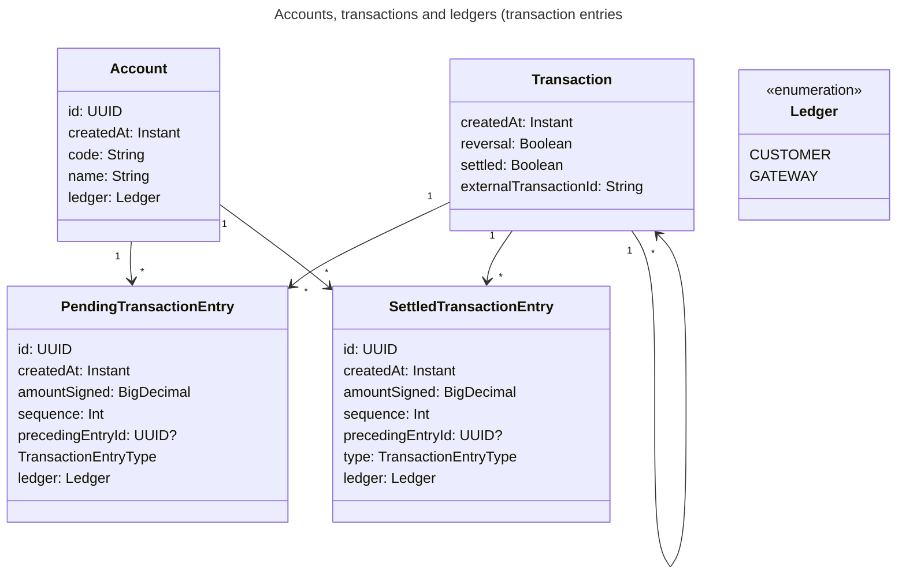

# ledger

## Architecture

The app is implemented using Spring Boot and REST APIs.\
Backend database is Postgres which is run locally using [compose.yaml](./compose.yaml)

### Model

Model can be found in [model package](./src/main/kotlin/com/oeyvind/ledger/model/entity)

- The enum [Ledger](./src/main/kotlin/com/oeyvind/ledger/model/Ledger.kt) defines the ledgers available. Customer and
  Gateway. Note that the Gateway ledger allows going negative to be able to bootstrap the ledger system.
- [Account](./src/main/kotlin/com/oeyvind/ledger/model/entity/Account.kt) - This represents an account
- [Transaction](./src/main/kotlin/com/oeyvind/ledger/model/entity/Transaction.kt) - This represents a transaction and
  contains entries. I chose to allow more than 1 pair of entries (debit and credit) to have a rich underlying model
- [PendingTransactionEntry](./src/main/kotlin/com/oeyvind/ledger/model/entity/PendingTransactionEntry.kt) - Pending
  transaction entry. Used to model pending debit and credit. Pending debit is not spendable
- [SettledTransactionEntry](./src/main/kotlin/com/oeyvind/ledger/model/entity/SettledTransactionEntry.kt) - Settled
  transaction entry. Used to model settled debit and credit.

### Class diagram

### Automatic testing

Unfortunately due to time constraints I was not able to add tests as much as I'd like to.\
I'm outlining here how this should be done.

#### Unit tests
The code should be divided up into smaller components that can be tested individually using mocks.\
This will allow testing all paths extensively.

#### API Contracts
Using MockBean I would like to test API contracts while mocking services to ensure correctness.

#### Integration Tests
There should be tests that test all the layers and ensure the database is in expected state after each test.\
This is important because each operation has plenty of side-effects.\
There is one suite of tests, see [TransactionTest](./src/test/kotlin/com/oeyvind/ledger/integration/TransactionTest.kt)

### APIs

#### Account APIs

See [AccountsController](./src/main/kotlin/com/oeyvind/ledger/controller/AccountsController.kt)

##### Create Account

URL: [server]/accounts
Parameters:

| name   | description                                                        |
|--------|--------------------------------------------------------------------|
| code   | short code for account                                             |
| name   | descriptive name                                                   |
| ledger | See [Ledger](./src/main/kotlin/com/oeyvind/ledger/model/Ledger.kt) |

##### Get balance

URL: [server]/{account-code}/balance
Returns full balance

##### List transactions

URL: [server]/{account-code}/transactions
Returns all transactions an account was involved in

#### Transaction APIs

##### Create pending transaction

URL: [server]/transactions
Parameters

| name            | description       |
|-----------------|-------------------|
| transactionId   | idempotent id     |
| amount          | amount            |
| fromAccountCode | from account code |
| toAccountCode   | to account code   |
| type            | PAYMENT           |

Creates a pending transaction with pending entries.\
Debit for from account and credit for to account.

##### Reverse pending transaction
[server]/{transaction-id}/reverse
Reverses fully or partially a transaction
Parameters

| name            | description       |
|-----------------|-------------------|
| transactionId   | idempotent id     |
| amount          | amount            |

Only allows up to total amount in original transaction.

##### Settle transaction
URL: /{transaction-id}/settle
Settles a pending transaction

## Simplifications/Room for improvement

### Currency

Currently, the system assumes everything is the same currency.\
This could easily be fixed by adding support for currencies in appropriate tables.

### Simple transactions with 2 parties

The underlying model supports multiple account transfers but for simplicity the API only supports one source and one
target account.\
The API for search transactions is a bit clumsy since it returns all transactions an account has participated in.

### Debit/Credit column

In hindsight, it would have been better to use one credit and one debit column.\
This would have made it possible to calculate balance with one query instead of 2.

### Use Result4k
Instead of throwing exceptions I would like to use a library like [Result4k](https://github.com/npryce/result4k/blob/master/src/main/kotlin/com/natpryce/result.kt) to ensure we return a typed error instead of throwing exceptions.

### Pending ledger archiving
The pending ledger should be kept small and archived frequently.\ 
This will allow quick and scalable queries to determine pending debit 

## Ensuring consistency

All ledger entries are added via the [LedgerGaggle](./src/main/kotlin/com/oeyvind/ledger/service/model/LedgerGaggle.kt) which ensures the ledger is balanced.\
In addition there are triggers and functions in the [DDL](/src/main/resources/db/migration/V1__baseline.sql) which ensures the ledger is balanced.

## Running locally

### Pre-requisites

#### JDK 17, Gradle and Kotlin

Use Sdkman to install these from https://sdkman.io/sdks/

#### Docker

### Running app

Run using `./gradlew bootRun` see [here](https://docs.spring.io/spring-boot/gradle-plugin/running.html)

## Testing

### Create accounts

curl -i -X PUT 'http://localhost:8080/accounts' \
-H 'Accept: application/json' \
-H 'Content-type: application/json' \
-d '{"code":"stripe","name":"Stripe Gateway","ledger":"GATEWAY"}'

curl -i -X PUT 'http://localhost:8080/accounts' \
-H 'Accept: application/json' \
-H 'Content-type: application/json' \
-d '{"code":"oeyvind","name":"Oeyvind Eliassen","ledger":"CUSTOMER"}'

curl -i -X PUT 'http://localhost:8080/accounts' \
-H 'Accept: application/json' \
-H 'Content-type: application/json' \
-d '{"code":"pierre","name":"Pierre","ledger":"CUSTOMER"}'

### Create a pending transaction and settle
curl -i -X PUT 'http://localhost:8080/transactions' \
-H 'Accept: application/json' \
-H 'Content-type: application/json' \
-d '{"transactionId":"tx-1","amount":"100","fromAccountCode":"stripe","toAccountCode":"oeyvind","type":"PAYMENT"}'

curl -i -X PUT 'http://localhost:8080/transactions/tx-1/settle' \
-H 'Accept: application/json' \
-H 'Content-type: application/json'

### Create a pending transaction, partiall reverse and settle
curl -i -X PUT 'http://localhost:8080/transactions' \
-H 'Accept: application/json' \
-H 'Content-type: application/json' \
-d '{"transactionId":"tx-2","amount":"40","fromAccountCode":"oeyvind","toAccountCode":"pierre","type":"PAYMENT"}'

curl -i -X PUT 'http://localhost:8080/transactions/tx-2/reverse' \
-H 'Accept: application/json' \
-H 'Content-type: application/json' \
-d '{"transactionId":"r-tx-2","amount":"10"}'

curl -i -X PUT 'http://localhost:8080/transactions/tx-2/settle' \
-H 'Accept: application/json' \
-H 'Content-type: application/json'

### Do it one more time
curl -i -X PUT 'http://localhost:8080/transactions' \
-H 'Accept: application/json' \
-H 'Content-type: application/json' \
-d '{"transactionId":"tx-3","amount":"40","fromAccountCode":"oeyvind","toAccountCode":"pierre","type":"PAYMENT"}'

curl -i -X PUT 'http://localhost:8080/transactions/tx-3/reverse' \
-H 'Accept: application/json' \
-H 'Content-type: application/json' \
-d '{"transactionId":"r-tx-3","amount":"10"}'

curl -i -X PUT 'http://localhost:8080/transactions/tx-3/settle' \
-H 'Accept: application/json' \
-H 'Content-type: application/json'

### Get total balance for a user
curl -i -X GET 'http://localhost:8080/accounts/oeyvind/balance' \
-H 'Accept: application/json' \
-H 'Content-type: application/json' \

### List all transactions
curl -i -X GET 'http://localhost:8080/accounts/oeyvind/transactions' \
-H 'Accept: application/json' \
-H 'Content-type: application/json' \

